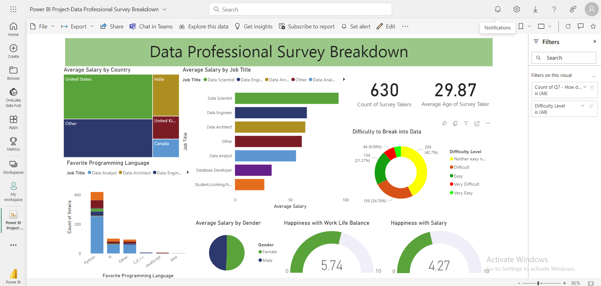

# 📊 Data Professional Survey Breakdown (Power BI Project)

## 📌 Project Overview
This project analyzes survey data from data professionals to understand salary trends, job roles, skills, and career challenges.  
Using Power BI, raw data was cleaned, transformed, and converted into an interactive dashboard that provides actionable insights.

---

## 🧩 Business Problem
Organizations and aspiring professionals lack clear insights into:
- Salary trends across job roles and countries  
- Skills demand in the data industry  
- Difficulty of entering the data field  
- Work-life balance and job satisfaction  

---

## 🎯 Goal
To analyze survey data and build an interactive dashboard that helps understand:
- Salary distribution  
- Job market trends  
- Skills demand  
- Career challenges in data industry  

---

## 📊 Dataset
### 📑 Key Columns

- **Age** → Age of respondent  
- **Gender** → Gender distribution  
- **Country** → Location of respondent  
- **Job Title** → Role (Data Analyst, Data Scientist, etc.)  
- **Years of Experience** → Experience level in years  
- **Current Yearly Salary** → Salary range (text format)  
- **Avg Salary** → Calculated numeric salary (derived column)  
- **Favorite Programming Language** → Preferred language  
- **Work Life Balance** → Satisfaction rating  
- **Salary Satisfaction** → Salary satisfaction score  
- **Difficulty to Break into Data** → Entry difficulty level  

---

## 📊 Dashboard Preview


---

🔗 **Live Dashboard:**  
👉 https://app.powerbi.com/links/XtnfDRj8Jw?ctid=36267bd2-9d09-4598-a33d-71dbb1296db4&pbi_source=linkShare  

---

## 🧹 Data Cleaning (Power Query)
- Removed unnecessary columns  
- Renamed columns for clarity  
- Filtered irrelevant values  
- Standardized categorical fields  
- Split columns using delimiter  
- Cleaned and transformed text fields  
- Created new calculated columns  

### 💰 Salary Transformation
- Converted salary ranges (e.g., "100-125k") into numeric values  
- Extracted min & max values  
- Calculated average salary  
- Converted to decimal format  

---

## 📊 Key Visuals

- **Average Salary by Job Title** → Stacked Bar Chart  
- **Average Salary by Country** → Treemap  
- **Favorite Programming Language** → Stacked Column Chart  
- **Salary by Gender** → Donut Chart  
- **Difficulty to Break into Data** → Donut Chart  
- **Happiness with Salary & Work-Life Balance** → Gauge Charts  
- **Total Survey Takers & Avg Age** → KPI Cards  

---

## 🔍 Key Insights

- Data Scientists and Data Engineers earn the highest salaries  
- United States shows highest average salary compared to other countries  
- Python is the most preferred programming language  
- Majority of respondents find it moderately difficult to enter data field  
- Work-life balance satisfaction is higher than salary satisfaction  
- Gender-based salary differences exist but are not extremely high  

---

## 💼 Business Impact

- Helps professionals choose high-paying roles  
- Guides companies in salary benchmarking  
- Identifies in-demand skills  
- Supports career planning in data industry  
- Helps improve hiring and training strategies  

---

## 🛠 Tools Used
- Power BI  
- Power Query  
- Data Visualization  
- Data Cleaning  

---

## 📂 Repository Structure
```
data-professional-survey-powerbi-dashboard/
│
├── dataset/
│   └── data_professional_survey.xlsx
│
├── pbix/
│   └── survey_dashboard.pbix
│
├── images/
│   └── powerbi_dashboard.png
│
├── docs/
│   └── data_catalog.md
│
├── README.md
└── .gitignore
```

---

## 🛡️ License

This project is licensed under the [MIT License](LICENSE). You are free to use, modify, and share this project with proper attribution.

## 🌟 About Me

Hi there! I'm **Sumit Sutar**. An experienced Data Analyst who uncovers hidden trends, patterns and anomalies and leverages business intelligence to generate insights, improve operational efficiency and drive organizational growth.


Let's stay in touch! Feel free to connect with me on the following platforms:

[](https://www.linkedin.com/in/sumitsutar2507)
